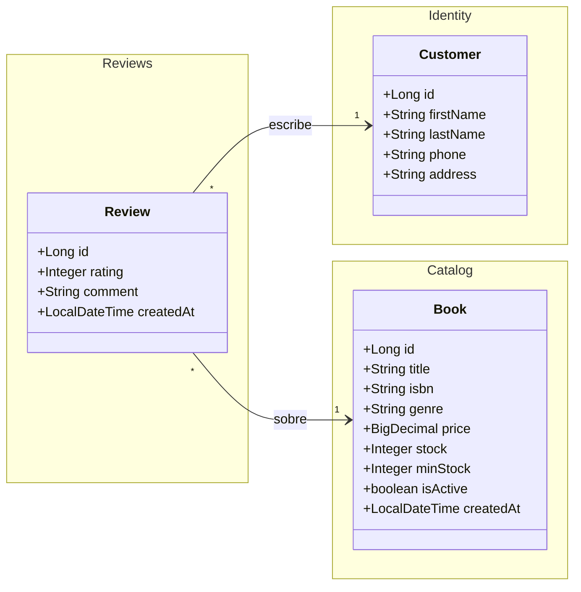

# Actividad de Aprendizaje: Persistencia de Datos con Spring Data JPA
**1ACC0236 Ingeniería de Software | Escuela CC | Ciclo 2026-1**
Elaborado por: Henry Antonio Mendoza Puerta

---

## 1. Objetivo

Poner en práctica lo explicado en el Lab 03-A — Persistencia de Datos con Spring Data JPA: crear una nueva entidad JPA, asociarla con entidades existentes del proyecto y definir los repositorios con los tres tipos de consulta a partir de User Stories reales del dominio BookStore.

---

## 2. User Stories

### 2.1 Épicas

| Epic ID | Título | Descripción |
|---|---|---|
| EP03 | Reseñas y Valoraciones | Publicación, edición, moderación y consulta de reseñas por lectores. |

### 2.2 Historias de Usuario

**US-06 · EP03 — Publicar una reseña de un libro comprado**

COMO lector QUIERO publicar una reseña con calificación y comentario sobre un libro que compré PARA compartir mi opinión con otros lectores de BookStore.

| Criterio de Aceptación | Descripción |
|---|---|
| Escenario exitoso: Reseña publicada | Dado que el lector selecciona un libro de su historial de compras y completa calificación (1-5) y comentario, Cuando presiona Publicar, Entonces la reseña queda registrada y visible en el detalle del libro. |
| Escenario error: Reseña duplicada | Dado que el lector ya publicó una reseña del mismo libro, Cuando intenta publicar otra, Entonces el sistema muestra "Ya publicaste una reseña para este libro". |

**US-07 · EP03 — Consultar reseñas de un libro**

COMO lector QUIERO ver las reseñas de un libro ordenadas por calificación PARA decidir si lo compro basándome en la opinión de otros lectores.

| Criterio de Aceptación | Descripción |
|---|---|
| Escenario exitoso: Reseñas encontradas | Dado que el lector abre el detalle de un libro con reseñas publicadas, Cuando consulta las reseñas, Entonces el sistema retorna la lista ordenada de mayor a menor calificación con el nombre del cliente, calificación y comentario. |
| Escenario alternativo: Sin reseñas | Dado que el libro no tiene reseñas publicadas, Cuando el lector consulta las reseñas, Entonces el sistema retorna una lista vacía sin mostrar mensaje de error. |

---

## 3. Diagrama de Clases — Entidad Review

### Relaciones

| Clase | Relación UML | Con | Tipo | Por qué |
|---|---|---|---|---|
| `Review` | Asociación `-->` | `Customer` | `@ManyToOne` | Un cliente puede tener muchas reseñas. Customer existe independientemente. |
| `Review` | Asociación `-->` | `Book` | `@ManyToOne` | Una reseña pertenece a un libro. Book existe independientemente. |

---

## 4. Tareas a Realizar

### Tarea 1 — Crear la entidad Review.java

Crear en el paquete `com.bookstore.model` con los siguientes atributos:

| Atributo | Tipo | Restricción |
|---|---|---|
| `id` | `Long` | `@Id`, `@GeneratedValue(IDENTITY)` |
| `rating` | `Integer` | `@Column(nullable = false)` — valores entre 1 y 5 |
| `comment` | `String` | `@Column(length = 1000)` — opcional |
| `createdAt` | `LocalDateTime` | `@Column(updatable = false)` — `@PrePersist` |
| `customer` | `Customer` | `@ManyToOne(LAZY)` + `@JoinColumn(name = "customer_id")` |
| `book` | `Book` | `@ManyToOne(LAZY)` + `@JoinColumn(name = "book_id")` |

> Usar las anotaciones Lombok: `@Data @Builder @NoArgsConstructor @AllArgsConstructor`

### Tarea 2 — Crear ReviewRepository.java

Crear en el paquete `com.bookstore.repository`. Implementar los siguientes métodos:

| Tipo de query | US | Método a implementar |
|---|---|---|
| Query Method | US-07 | Buscar reseñas de un libro ordenadas por calificación descendente |
| Query Method | US-06 | Verificar si un cliente ya publicó reseña de un libro (para evitar duplicados) |
| SQL nativo | US-07 | Calcular el promedio de calificación de un libro |

### Tarea 3 — Test desde el método main

Agregar al `@Bean CommandLineRunner` existente en `BookstoreApiApplication.java`:

1. Inyectar `ReviewRepository` en el `initData`
2. Crear dos reseñas para `libro1` con distintas calificaciones usando el builder con todos los campos NOT NULL explícitos
3. Verificar Query Method: buscar reseñas del `libro1` ordenadas por calificación
4. Verificar JPQL: obtener solo reseñas visibles del `libro1`
5. Verificar SQL nativo: imprimir el promedio de calificación del `libro1`

---

