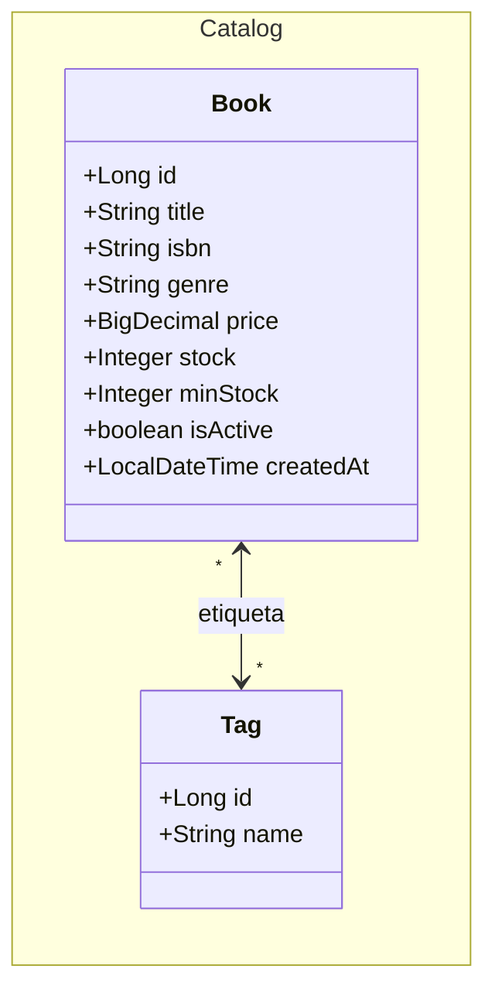
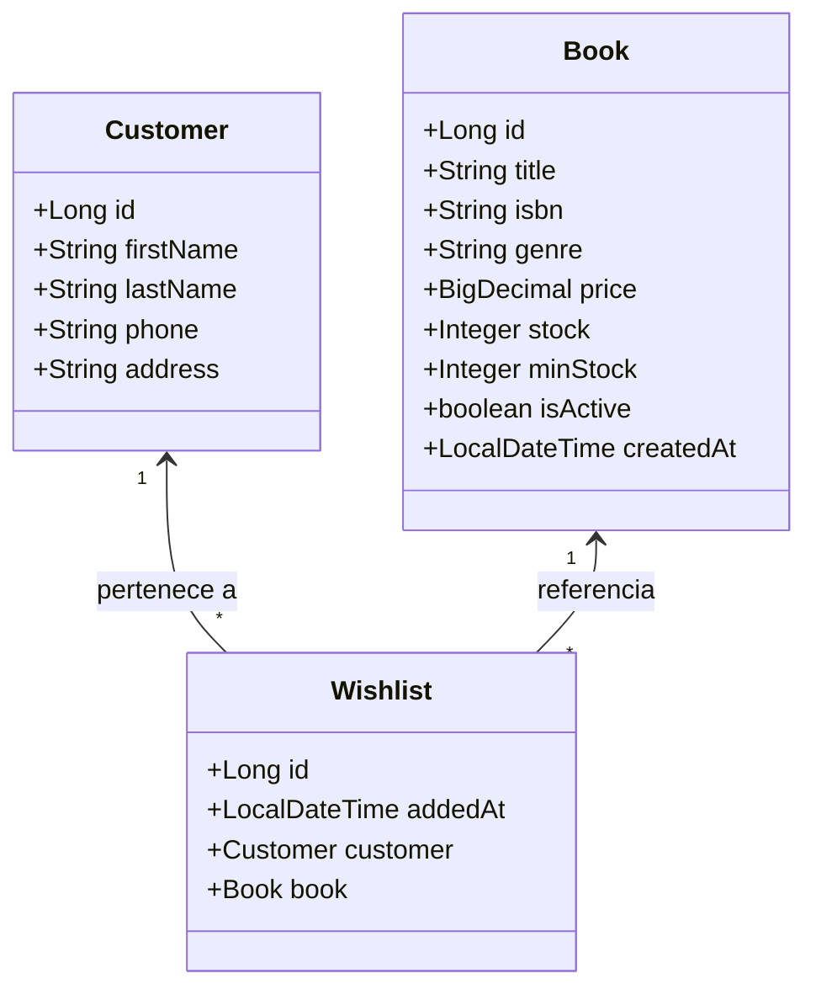

# Actividad de Aprendizaje: Persistencia de Datos con Spring Data JPA
**1ACC0236 Ingeniería de Software | Escuela CC | Ciclo 2026-1**
Elaborado por: Henry Antonio Mendoza Puerta

---

## 1. Objetivo

Poner en práctica lo explicado en el Lab 03-A — Persistencia de Datos con Spring Data JPA: crear nuevas entidades JPA con distintos tipos de asociación, definir repositorios con los tres tipos de consulta y verificar la persistencia ejecutando un test desde el método main.

---

## 2. User Stories

### 3.1 Épicas

| Epic ID | Título | Descripción |
|---|---|---|
| EP01 | Gestión de Catálogo | Búsqueda, registro y administración del catálogo de libros y autores. |
| EP03 | Reseñas y Valoraciones | Publicación, edición, moderación y consulta de reseñas por lectores. |

### 3.2 Historias de Usuario

**US-06 · EP03 — Publicar una reseña de un libro comprado**

COMO lector QUIERO publicar una reseña con calificación y comentario sobre un libro que compré PARA compartir mi opinión con otros lectores de BookStore.

| Criterio de Aceptación | Descripción |
|---|---|
| Escenario exitoso: Reseña publicada | Dado que el lector selecciona un libro de su historial de compras y completa calificación (1-5) y comentario, Cuando presiona Publicar, Entonces la reseña queda registrada en el detalle del libro. |
| Escenario error: Reseña duplicada | Dado que el lector ya publicó una reseña del mismo libro, Cuando intenta publicar otra, Entonces el sistema muestra "Ya publicaste una reseña para este libro". |

---

**US-07 · EP03 — Consultar reseñas de un libro**

COMO lector QUIERO ver las reseñas de un libro ordenadas por calificación PARA decidir si lo compro basándome en la opinión de otros lectores.

| Criterio de Aceptación | Descripción |
|---|---|
| Escenario exitoso: Reseñas encontradas | Dado que el lector abre el detalle de un libro con reseñas publicadas, Cuando consulta las reseñas, Entonces el sistema retorna la lista ordenada de mayor a menor calificación con el nombre del cliente, calificación y comentario. |
| Escenario alternativo: Sin reseñas | Dado que el libro no tiene reseñas publicadas, Cuando el lector consulta las reseñas, Entonces el sistema retorna una lista vacía sin mostrar mensaje de error. |

---

**US-08 · EP01 — Etiquetar un libro con géneros**

COMO propietario de librería QUIERO asociar etiquetas a un libro PARA que los lectores puedan filtrar el catálogo por género o temática.

| Criterio de Aceptación | Descripción |
|---|---|
| Escenario exitoso: Etiqueta asociada | Dado que el propietario selecciona un libro y elige una o más etiquetas, Cuando presiona Guardar, Entonces el libro queda asociado a las etiquetas seleccionadas. |
| Escenario alternativo: Sin etiquetas | Dado que un libro no tiene etiquetas asignadas, Cuando el lector filtra por etiqueta, Entonces el libro no aparece en los resultados. |

---

**US-09 · EP01 — Guardar un libro en lista de deseos**

COMO lector QUIERO guardar un libro en mi lista de deseos PARA encontrarlo fácilmente cuando quiera comprarlo.

| Criterio de Aceptación | Descripción |
|---|---|
| Escenario exitoso: Libro guardado | Dado que el lector selecciona un libro del catálogo, Cuando presiona Guardar en lista de deseos, Entonces el libro queda registrado en su lista con la fecha en que lo agregó. |
| Escenario error: Libro duplicado | Dado que el lector ya tiene el libro en su lista de deseos, Cuando intenta guardarlo nuevamente, Entonces el sistema muestra "Este libro ya está en tu lista de deseos". |

---

## 4. Parte A — Entidad Review (@ManyToOne)

### 4.1 Diagrama de Clases


### 4.2 Relaciones

| Clase | Relación UML | Con | Tipo | Por qué |
|---|---|---|---|---|
| `Review` | Asociación `-->` | `Customer` | `@ManyToOne` | Un cliente puede tener muchas reseñas. Customer existe independientemente. |
| `Review` | Asociación `-->` | `Book` | `@ManyToOne` | Una reseña pertenece a un libro. Book existe independientemente. |

### 4.3 Tarea 1 — Crear Review.java

Crear en el paquete `com.bookstore.model`:

| Atributo | Tipo | Restricción |
|---|---|---|
| `id` | `Long` | `@Id`, `@GeneratedValue(IDENTITY)` |
| `rating` | `Integer` | `@Column(nullable = false)` — valores entre 1 y 5 |
| `comment` | `String` | `@Column(length = 1000)` — opcional |
| `createdAt` | `LocalDateTime` | `@Column(updatable = false)` — `@PrePersist` |
| `customer` | `Customer` | `@ManyToOne(LAZY)` + `@JoinColumn(name = "customer_id")` |
| `book` | `Book` | `@ManyToOne(LAZY)` + `@JoinColumn(name = "book_id")` |

> Usar: `@Data @Builder @NoArgsConstructor @AllArgsConstructor`

### 4.4 Tarea 2 — Crear ReviewRepository.java

| Tipo de query | US | Método a implementar |
|---|---|---|
| Query Method | US-07 | Buscar reseñas de un libro ordenadas por calificación descendente |
| Query Method | US-06 | Verificar si un cliente ya publicó reseña de un libro |
| SQL nativo | US-07 | Calcular el promedio de calificación de un libro |

### 4.5 Tarea 3 — Test en el método main

1. Inyectar `ReviewRepository` en el `initData`
2. Crear dos reseñas para `libro1` con distintas calificaciones — pasar todos los campos NOT NULL explícitos
3. Verificar Query Method: buscar reseñas del `libro1` ordenadas por calificación
4. Verificar SQL nativo: imprimir el promedio de calificación del `libro1`
5. Verificar duplicado: `existsByCustomerIdAndBookId` debe retornar `true`

---

## 5. Parte B — Entidad Tag (@ManyToMany)

### 5.1 Diagrama de Clases



### 5.2 Relaciones

| Clase | Relación UML | Con | Tipo | Por qué |
|---|---|---|---|---|
| `Book` | `@ManyToMany` | `Tag` | Asociación bidireccional | Un libro tiene muchas etiquetas. Una etiqueta agrupa muchos libros. La relación no necesita atributos propios — solo quién está relacionado con quién. |

> Spring crea automáticamente la tabla intermedia `book_tags` con las columnas `book_id` y `tag_id`. No necesitas definirla.

### 5.3 Tarea 4 — Crear Tag.java

Crear en el paquete `com.bookstore.model`:

| Atributo | Tipo | Restricción |
|---|---|---|
| `id` | `Long` | `@Id`, `@GeneratedValue(IDENTITY)` |
| `name` | `String` | `@Column(nullable = false, unique = true, length = 50)` |
| `books` | `List<Book>` | `@ManyToMany(mappedBy = "tags")` |

> Usar: `@Data @Builder @NoArgsConstructor @AllArgsConstructor`

### 5.4 Actualizar Book.java

Agregar en `Book.java` el lado dueño de la relación:

```java
@ManyToMany
@JoinTable(
    name = "book_tags",
    joinColumns = @JoinColumn(name = "book_id"),
    inverseJoinColumns = @JoinColumn(name = "tag_id")
)
private List<Tag> tags;
```

### 5.5 Tarea 5 — Crear TagRepository.java

```java
public interface TagRepository extends JpaRepository<Tag, Long> {

    // Buscar etiqueta por nombre exacto — evita duplicados (US-08)
    Optional<Tag> findByName(String name);
    boolean existsByName(String name);
}
```

### 5.6 Tarea 6 — Test en el método main

1. Inyectar `TagRepository` en el `initData`
2. Crear dos tags: `CLASICO` y `LATINOAMERICA`
3. Agregar ambos tags a `libro1` — inicializar la lista antes de agregar
4. Guardar `libro1` con `bookRepo.save(libro1)`
5. Verificar en pgAdmin que existe la tabla `book_tags` con los registros

---

## 6. Parte C — Entidad Wishlist (Clase Intermedia)

### 6.1 Diagrama de Clases



### 6.2 Relaciones

| Clase | Relación UML | Con | Tipo | Por qué |
|---|---|---|---|---|
| `Wishlist` | Asociación `-->` | `Customer` | `@ManyToOne` | Un cliente puede guardar muchos libros en favoritos. Customer existe independientemente. |
| `Wishlist` | Asociación `-->` | `Book` | `@ManyToOne` | Un libro puede ser guardado en favoritos por muchos clientes. Book existe independientemente. |

> **¿Por qué clase intermedia y no `@ManyToMany`?** Con `@ManyToMany` puro Spring crea la tabla intermedia automáticamente, pero no puedes agregarle columnas. En este caso necesitamos `addedAt` — la fecha en que el cliente guardó el libro. Por eso `Wishlist` es una entidad propia con `@ManyToOne` hacia `Customer` y `Book`.

### 6.3 Tarea 7 — Crear Wishlist.java

Crear en el paquete `com.bookstore.model`:

| Atributo | Tipo | Restricción |
|---|---|---|
| `id` | `Long` | `@Id`, `@GeneratedValue(IDENTITY)` |
| `addedAt` | `LocalDateTime` | `@Column(updatable = false)` — `@PrePersist` |
| `customer` | `Customer` | `@ManyToOne(LAZY)` + `@JoinColumn(name = "customer_id")` |
| `book` | `Book` | `@ManyToOne(LAZY)` + `@JoinColumn(name = "book_id")` |

> Usar: `@Data @Builder @NoArgsConstructor @AllArgsConstructor`

### 6.4 Tarea 8 — Crear WishlistRepository.java

| Tipo de query | US | Método a implementar |
|---|---|---|
| Query Method | US-09 | Buscar todas las entradas de la lista de deseos de un cliente |
| Query Method | US-09 | Verificar si un cliente ya tiene un libro en su lista |

### 6.5 Tarea 9 — Test en el método main

1. Inyectar `WishlistRepository` en el `initData`
2. Guardar `libro1` y `libro2` en favoritos de `sofia` usando `wishlistRepo.save(Wishlist.builder()...build())`
3. Verificar Query Method: listar los favoritos de `sofia`
4. Verificar duplicado: `existsByCustomerIdAndBookId` debe retornar `true`

---

## 7. Conclusión — ¿Cuándo usar @ManyToMany y cuándo clase intermedia?

En la **Parte B** usaste `@ManyToMany` porque la relación entre `Book` y `Tag` no necesita datos adicionales — solo importa saber qué tags tiene un libro. Spring crea la tabla intermedia automáticamente.

En la **Parte C** necesitabas guardar `addedAt`. Eso no es posible con `@ManyToMany` puro — no puedes agregar columnas a la tabla que Spring genera. Por eso `Wishlist` es una entidad propia.

---

## 8. Publicar en GitHub

### 8.1 Crear rama feature

```bash
git checkout develop
git checkout -b feature/associations-entities
```

### 8.2 Commit con los cambios

```bash
git add .
git commit -m "feat: implementar entidades Review, Tag y Wishlist"
git push -u origin feature/associations-entities
```

### 8.3 Ejemplo de Pull Request

**Título:**
```
feat: implementar entidades Review, Tag y Wishlist — Lab 03-A Actividad
```

**Descripción:**
```markdown
## ¿Qué incluye este PR?
- Parte A: Review.java con @ManyToOne hacia Customer y Book
- Parte B: Tag.java con @ManyToMany hacia Book
- Parte C: Wishlist.java como clase intermedia entre Customer y Book
- Repositorios con Query Method y SQL nativo
- Test verificado en consola (captura adjunta)

## User Stories cubiertas
US-06 Publicar reseña, US-07 Consultar reseñas,
US-08 Etiquetar libro, US-09 Guardar en favoritos

## Evidencia
[Screenshot consola — resultados de los tres bloques]
[Screenshot pgAdmin — tablas reviews, tags, book_tags, wishlists]
```

**Reviewers:** Asignar a otro integrante del equipo para revisión
