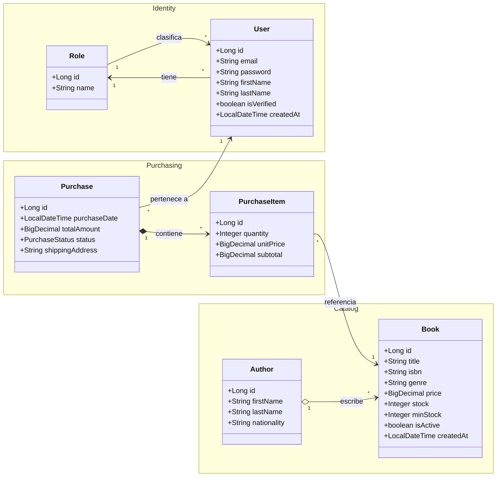
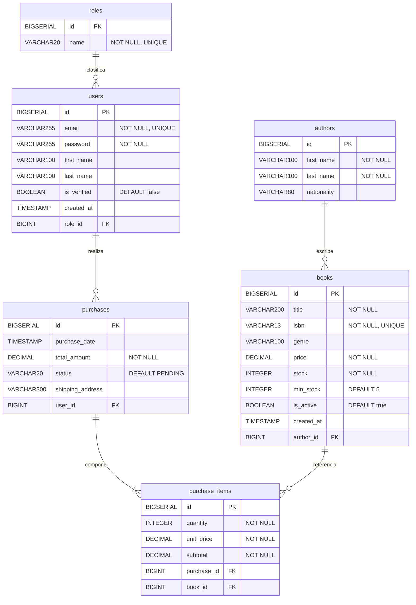

# Guía de Laboratorio 03 - A
## Persistencia con Spring Data JPA
**1ACC0236 Ingeniería de Software | Escuela CC | Ciclo 2026-1**
Elaborado por: Henry Antonio Mendoza Puerta

---

## 1. Persistencia con JPA, Hibernate y Spring Data JPA

Para que los datos de una aplicación Java sobrevivan al cierre del programa, deben guardarse en una base de datos. JPA define las reglas de cómo hacerlo. Hibernate las ejecuta. Spring Data JPA simplifica el acceso.

El flujo completo cuando se llama a `repository.save(book)` es:

```
Tu código Java
   └─ llama a  BookRepository.save(book)          ← Spring Data JPA
         └─ delega en  EntityManager.persist()    ← JPA (especificación)
               └─ ejecuta  INSERT INTO books ...  ← Hibernate (implementación)
                     └─ escribe en  PostgreSQL    ← Base de datos
```

### 1.1 Anotaciones JPA — Referencia

| Anotación | Propósito |
|---|---|
| `@Entity` | Marca la clase como entidad gestionada por Hibernate. |
| `@Table(name=)` | Define el nombre exacto de la tabla en la base de datos. |
| `@Id` | Declara el campo como clave primaria. |
| `@GeneratedValue(IDENTITY)` | Delega el auto-incremento al SERIAL de PostgreSQL. |
| `@Column` | Configura la columna: nullable, unique, length, precision. |
| `@ManyToOne` | Muchos registros apuntan a uno. La FK queda en la tabla actual. |
| `@OneToMany(mappedBy)` | Un registro tiene muchos hijos. mappedBy indica el campo dueño. |
| `@JoinColumn(name=)` | Nombre de la columna de clave foránea en la tabla. |
| `cascade = CascadeType.ALL` | Las operaciones (persist, remove) se propagan a los hijos. |
| `orphanRemoval = true` | Elimina automáticamente los hijos que quedan sin padre. |
| `FetchType.LAZY` | Carga la relación solo cuando se accede, evitando consultas innecesarias. |
| `@PrePersist` | Ejecuta un método justo antes de insertar el registro en la BD. |

---

## 2. Objetivo

Al finalizar el laboratorio, el estudiante implementa entidades JPA con asociaciones sobre el dominio BookStore, define repositorios con los tres tipos de consulta (Query Method, JPQL y SQL nativo) y verifica la persistencia ejecutando un test desde el método main.

---

## 3. User Stories

### 3.1 Épicas

| Epic ID | Título | Descripción |
|---|---|---|
| EP01 | Gestión de Catálogo | Búsqueda, registro y administración del catálogo de libros y autores. |
| EP02 | Proceso de Compra | Registro de compras, seguimiento de pedidos y consulta de historial. |

### 3.2 Historias de Usuario

#### US-01 · EP01 — Registrar autor en el catálogo

**Historia de Usuario**
COMO propietario de librería QUIERO registrar los datos de un autor PARA asociar sus libros al catálogo de BookStore.

**Criterio de Aceptación — Escenario exitoso: Autor registrado**
Dado que el propietario completa nombre, apellido y nacionalidad del autor,
Cuando presiona Guardar,
Entonces el autor queda registrado y disponible para asociarse a libros.

**Criterio de Aceptación — Escenario error: Datos incompletos**
Dado que el propietario omite el apellido del autor,
Cuando intenta guardar,
Entonces el sistema muestra el mensaje "El apellido del autor es obligatorio".

---

#### US-02 · EP01 — Registrar libro en el catálogo

**Historia de Usuario**
COMO propietario de librería QUIERO registrar un libro con su autor, género y precio PARA que los lectores lo encuentren en el catálogo de BookStore.

**Criterio de Aceptación — Escenario exitoso: Libro registrado**
Dado que el propietario completa título, ISBN, género, precio, stock y selecciona un autor registrado,
Cuando presiona Guardar,
Entonces el libro aparece en el catálogo con estado activo y el nombre completo del autor.

**Criterio de Aceptación — Escenario error: ISBN duplicado**
Dado que el propietario ingresa un ISBN ya registrado en el sistema,
Cuando intenta guardar,
Entonces el sistema muestra "El ISBN ya se encuentra registrado en el catálogo".

---

#### US-03 · EP01 — Buscar libros por género y precio máximo

**Historia de Usuario**
COMO lector QUIERO buscar libros filtrando por género y precio máximo PARA encontrar opciones disponibles dentro de mi presupuesto.

**Criterio de Aceptación — Escenario exitoso: Resultados encontrados**
Dado que el lector selecciona el género FICTION y un precio máximo de S/50,
Cuando ejecuta la búsqueda,
Entonces el sistema retorna únicamente libros activos del género seleccionado con precio menor o igual a S/50.

**Criterio de Aceptación — Escenario alternativo: Sin resultados**
Dado que no existen libros del género seleccionado dentro del precio indicado,
Cuando ejecuta la búsqueda,
Entonces el sistema retorna una lista vacía sin mostrar mensaje de error.

---

#### US-04 · EP02 — Registrar una compra

**Historia de Usuario**
COMO lector QUIERO confirmar la compra de los libros seleccionados PARA generar un pedido con el detalle de los títulos adquiridos.

**Criterio de Aceptación — Escenario exitoso: Compra registrada**
Dado que el lector tiene al menos un libro en el carrito con stock disponible,
Cuando confirma la compra,
Entonces el sistema genera un Purchase con estado PENDING y sus PurchaseItems con el precio unitario y subtotal de cada título.

**Criterio de Aceptación — Escenario error: Sin stock**
Dado que uno de los libros del carrito tiene stock igual a cero,
Cuando el lector intenta confirmar la compra,
Entonces el sistema muestra "El libro [título] no tiene stock disponible" y no genera el pedido.

---

#### US-05 · EP02 — Consultar historial de compras por rango de fechas

**Historia de Usuario**
COMO lector QUIERO consultar mis compras filtrando por fecha de inicio y fecha de fin PARA revisar mis pedidos dentro de un periodo específico.

**Criterio de Aceptación — Escenario exitoso: Compras encontradas**
Dado que el lector ingresa una fecha de inicio y una fecha de fin válidas,
Cuando consulta su historial,
Entonces el sistema retorna únicamente sus compras cuya fecha de registro se encuentre dentro del rango indicado, ordenadas de más reciente a más antigua.

**Criterio de Aceptación — Escenario alternativo: Sin compras en el periodo**
Dado que el lector no realizó compras en el rango de fechas indicado,
Cuando consulta su historial,
Entonces el sistema retorna una lista vacía sin mostrar mensaje de error.

---

## 4. Diagrama de Clases del Dominio

> **Notación UML:** `-->` asociación · `o-->` agregación (rombo sin relleno) · `*-->` composición (rombo con relleno)



### Relaciones y anotaciones JPA correspondientes

| Clase | Relación UML | Con | Tipo | Anotación JPA | Por qué |
|---|---|---|---|---|---|
| `Book` | Asociación `-->` | `Author` | `@ManyToOne` | `@ManyToOne` + `@JoinColumn` | Un libro referencia a un autor. Author existe independiente de Book. |
| `User` | Asociación `-->` | `Role` | `@ManyToOne` | `@ManyToOne` + `@JoinColumn` | Un usuario tiene un rol. Role es un catálogo independiente. |
| `Purchase` | Asociación `-->` | `User` | `@ManyToOne` | `@ManyToOne` + `@JoinColumn` | Una compra pertenece a un usuario. User existe independiente. |
| `Author` | Agregación `o-->` | `Book` | `@OneToMany` | `@OneToMany(mappedBy)` | Author agrupa Books pero ambos pueden existir por separado. |
| `Purchase` | Composición `*-->` | `PurchaseItem` | `@OneToMany` | `@OneToMany(cascade, orphanRemoval)` | PurchaseItem no tiene sentido sin Purchase. |
| `PurchaseItem` | Asociación `-->` | `Book` | `@ManyToOne` | `@ManyToOne` + `@JoinColumn` | Un ítem referencia un libro. El libro existe independiente del ítem. |

---

## 5. Prerrequisitos

- Proyecto `bookstore_api` abierto en IntelliJ IDEA
- Docker Desktop instalado y corriendo en el equipo
- Archivo `archivos.zip` descargado del aula virtual y descomprimido (contiene `docker-compose.yml`)

---

## 6. Levantar los Contenedores Docker

### 6.1 Iniciar con terminal

Abrir una terminal en la carpeta donde se encuentra `docker-compose.yml` y ejecutar:

```bash
# Levantar PostgreSQL y pgAdmin en segundo plano
docker compose up -d

# Verificar que ambos contenedores estén en estado Up
docker ps
```

Salida esperada:

```
bookstore-postgres   postgres:16       0.0.0.0:5434->5432/tcp   Up
bookstore-pgadmin    dpage/pgadmin4    0.0.0.0:5050->80/tcp     Up
```

### 6.2 Alternativa: Docker Desktop

Abrir Docker Desktop, ir a la pestaña **Containers** y verificar que los contenedores `bookstore-postgres` y `bookstore-pgadmin` muestren estado **Running**.

### 6.3 Detener al terminar

```bash
docker compose down
```

### 6.4 Acceder a pgAdmin

| Dato | Valor |
|---|---|
| URL | http://localhost:5050 |
| Email | admin@admin.com |
| Password | admin |

Registrar el servidor de base de datos con:

| Campo | Valor |
|---|---|
| Host | `postgres` |
| Port | `5432` |
| Database | `bookstore_db` |
| Username | `postgres` |
| Password | `adminadmin` |

> **Nota:** El host dentro de pgAdmin es `postgres` (nombre del contenedor Docker), no `localhost`. Desde la aplicación Spring Boot sí se usa `localhost:5434` porque Spring corre fuera de Docker.

---

## 7. Lombok — Anotaciones de Reducción de Código

Lombok es una librería que genera automáticamente en tiempo de compilación el código repetitivo de las clases Java: getters, setters, constructores, equals, hashCode y toString.

| Anotación | Qué genera |
|---|---|
| `@Data` | Getters para todos los campos, setters para los no finales, equals, hashCode y toString. |
| `@Builder` | Patrón Builder para construir objetos con sintaxis fluida: `Clase.builder().campo(valor).build()`. |
| `@NoArgsConstructor` | Constructor sin argumentos. JPA lo requiere obligatoriamente para instanciar entidades. |
| `@AllArgsConstructor` | Constructor con todos los campos como parámetros. |

---

## 8. Crear el Enum PurchaseStatus

Crear el paquete `com.bookstore.model.enums` y el siguiente enum:

```java
package com.bookstore.model.enums;

public enum PurchaseStatus {
    PENDING, CONFIRMED, SHIPPED, DELIVERED, CANCELLED
}
```

---

## 9. Implementar las Entidades JPA

Crear cada clase en el paquete `com.bookstore.model`.

### 9.1 Role.java

```java
package com.bookstore.model;

import jakarta.persistence.*;
import lombok.*;

@Entity
@Table(name = "roles")
@Data @Builder @NoArgsConstructor @AllArgsConstructor
public class Role {

    @Id
    @GeneratedValue(strategy = GenerationType.IDENTITY)
    private Long id;

    @Column(nullable = false, unique = true, length = 20)
    private String name;
}
```

### 9.2 User.java

```java
package com.bookstore.model;

import jakarta.persistence.*;
import lombok.*;
import java.time.LocalDateTime;

@Entity
@Table(name = "users")
@Data @Builder @NoArgsConstructor @AllArgsConstructor
public class User {

    @Id
    @GeneratedValue(strategy = GenerationType.IDENTITY)
    private Long id;

    @Column(nullable = false, unique = true, length = 255)
    private String email;

    @Column(nullable = false, length = 255)
    private String password;

    @Column(length = 100)
    private String firstName;

    @Column(length = 100)
    private String lastName;

    @Column(nullable = false)
    private boolean isVerified = false;

    @Column(updatable = false)
    private LocalDateTime createdAt;

    @ManyToOne(fetch = FetchType.LAZY)
    @JoinColumn(name = "role_id", nullable = false)
    private Role role;

    @PrePersist
    protected void onCreate() { this.createdAt = LocalDateTime.now(); }
}
```

### 9.3 Author.java

```java
package com.bookstore.model;

import jakarta.persistence.*;
import lombok.*;

@Entity
@Table(name = "authors")
@Data @Builder @NoArgsConstructor @AllArgsConstructor
public class Author {

    @Id
    @GeneratedValue(strategy = GenerationType.IDENTITY)
    private Long id;

    @Column(nullable = false, length = 100)
    private String firstName;

    @Column(nullable = false, length = 100)
    private String lastName;

    @Column(length = 80)
    private String nationality;
}
```

### 9.4 Book.java

El campo `author` pasa de `String` a una relación `@ManyToOne` con la entidad `Author`. Indicado con comentario al costado del atributo.

```java
package com.bookstore.model;

import jakarta.persistence.*;
import lombok.*;
import java.math.BigDecimal;
import java.time.LocalDateTime;

@Entity
@Table(name = "books")
@Data @Builder @NoArgsConstructor @AllArgsConstructor
public class Book {

    @Id
    @GeneratedValue(strategy = GenerationType.IDENTITY)
    private Long id;

    @Column(nullable = false, length = 200)
    private String title;

    @Column(nullable = false, unique = true, length = 13)
    private String isbn;

    @Column(length = 100)
    private String genre;

    @Column(nullable = false, precision = 10, scale = 2)
    private BigDecimal price;

    @Column(nullable = false)
    private Integer stock;

    @Column(nullable = false)
    private Integer minStock = 5;

    @Column(length = 2000)
    private String description;

    @Column(nullable = false, unique = true, length = 300)
    private String slug;

    @Column(length = 500)
    private String imageUrl;

    @Column(length = 500)
    private String fileUrl;

    @Column(nullable = false)
    private boolean isActive = true;

    @Column(updatable = false)
    private LocalDateTime createdAt;

    @ManyToOne(fetch = FetchType.LAZY)                     // <-- cambia de String a entidad Author
    @JoinColumn(name = "author_id", nullable = false)
    private Author author;

    @PrePersist
    protected void onCreate() { this.createdAt = LocalDateTime.now(); }
}
```

### 9.5 Purchase.java

```java
package com.bookstore.model;

import com.bookstore.model.enums.PurchaseStatus;
import jakarta.persistence.*;
import lombok.*;
import java.math.BigDecimal;
import java.time.LocalDateTime;
import java.util.ArrayList;
import java.util.List;

@Entity
@Table(name = "purchases")
@Data @Builder @NoArgsConstructor @AllArgsConstructor
public class Purchase {

    @Id
    @GeneratedValue(strategy = GenerationType.IDENTITY)
    private Long id;

    @Column(updatable = false)
    private LocalDateTime purchaseDate;

    @Column(nullable = false, precision = 10, scale = 2)
    private BigDecimal totalAmount;

    @Enumerated(EnumType.STRING)
    @Column(nullable = false, length = 20)
    private PurchaseStatus status = PurchaseStatus.PENDING;

    @Column(length = 300)
    private String shippingAddress;

    @ManyToOne(fetch = FetchType.LAZY)
    @JoinColumn(name = "user_id", nullable = false)
    private User user;

    @OneToMany(mappedBy = "purchase",
               cascade = CascadeType.ALL,
               orphanRemoval = true)
    private List<PurchaseItem> items = new ArrayList<>();

    @PrePersist
    protected void onCreate() { this.purchaseDate = LocalDateTime.now(); }
}
```

### 9.6 PurchaseItem.java

```java
package com.bookstore.model;

import jakarta.persistence.*;
import lombok.*;
import java.math.BigDecimal;

@Entity
@Table(name = "purchase_items")
@Data @Builder @NoArgsConstructor @AllArgsConstructor
public class PurchaseItem {

    @Id
    @GeneratedValue(strategy = GenerationType.IDENTITY)
    private Long id;

    @Column(nullable = false)
    private Integer quantity;

    @Column(nullable = false, precision = 10, scale = 2)
    private BigDecimal unitPrice;

    @Column(nullable = false, precision = 10, scale = 2)
    private BigDecimal subtotal;

    @ManyToOne(fetch = FetchType.LAZY)
    @JoinColumn(name = "purchase_id", nullable = false)
    private Purchase purchase;

    @ManyToOne(fetch = FetchType.LAZY)
    @JoinColumn(name = "book_id", nullable = false)
    private Book book;
}
```

---

## 10. Repositorios Spring Data JPA

### 10.1 Los tres tipos de consulta

| Tipo | Cómo funciona | Cuándo usar |
|---|---|---|
| Query Method | Spring genera el SQL a partir del nombre del método | Búsquedas simples por uno o dos atributos |
| JPQL (`@Query`) | Consulta sobre clases Java, no sobre tablas SQL | Lógica de negocio y condiciones compuestas |
| SQL nativo | SQL puro de PostgreSQL (`nativeQuery = true`) | Funciones de BD, agrupaciones, optimización |

### 10.2 RoleRepository.java

```java
package com.bookstore.repository;

import com.bookstore.model.Role;
import org.springframework.data.jpa.repository.JpaRepository;

public interface RoleRepository extends JpaRepository<Role, Long> { }
```

### 10.3 UserRepository.java

```java
package com.bookstore.repository;

import com.bookstore.model.User;
import org.springframework.data.jpa.repository.JpaRepository;

public interface UserRepository extends JpaRepository<User, Long> { }
```

### 10.4 AuthorRepository.java

```java
package com.bookstore.repository;

import com.bookstore.model.Author;
import org.springframework.data.jpa.repository.JpaRepository;
import java.util.Optional;

public interface AuthorRepository extends JpaRepository<Author, Long> {

    // Verifica si ya existe un autor con ese apellido — evita duplicados (US-01)
    boolean existsByLastName(String lastName);

    // Retorna autor por apellido exacto — búsqueda en CRUD (US-01)
    Optional<Author> findByLastName(String lastName);
}
```

### 10.5 BookRepository.java

```java
package com.bookstore.repository;

import com.bookstore.model.Book;
import org.springframework.data.jpa.repository.JpaRepository;
import org.springframework.data.jpa.repository.Query;
import org.springframework.data.repository.query.Param;
import java.math.BigDecimal;
import java.util.List;
import java.util.Optional;

public interface BookRepository extends JpaRepository<Book, Long> {

    // ── Lab 02 — métodos existentes, se mantienen ─────────────────────────────
    List<Book> findByTitle(String title);
    Optional<Book> findBySlug(String slug);
    boolean existsBySlug(String slug);

    @Query("SELECT b FROM Book b WHERE b.stock < b.minStock")
    List<Book> findLowStockBooks();

    @Query(value = "SELECT * FROM books WHERE price > 50", nativeQuery = true)
    List<Book> findExpensiveBooks();

    // ── Lab 03 — métodos nuevos ───────────────────────────────────────────────

    // Retorna libro por ISBN — valida unicidad al registrar (US-02)
    Optional<Book> findByIsbn(String isbn);
    boolean existsByIsbn(String isbn);

    // Verifica que el libro tenga stock antes de permitir la compra (US-04)
    Optional<Book> findByIdAndStockGreaterThan(Long id, int stock);

    // Filtra libros activos por género — primer nivel de búsqueda (US-03)
    List<Book> findByGenreAndIsActiveTrue(String genre);

    // Filtra libros activos por género y precio máximo — búsqueda combinada (US-03)
    @Query("""
           SELECT b FROM Book b
           WHERE b.genre = :genre
             AND b.price <= :maxPrice
             AND b.isActive = true
           """)
    List<Book> findByGenreAndMaxPrice(@Param("genre") String genre,
                                      @Param("maxPrice") BigDecimal maxPrice);
}
```

### 10.6 PurchaseRepository.java

```java
package com.bookstore.repository;

import com.bookstore.model.Purchase;
import org.springframework.data.jpa.repository.JpaRepository;
import org.springframework.data.jpa.repository.Query;
import org.springframework.data.repository.query.Param;
import java.math.BigDecimal;
import java.time.LocalDateTime;
import java.util.List;

public interface PurchaseRepository extends JpaRepository<Purchase, Long> {

    // Retorna todas las compras de un usuario — historial general (US-04)
    List<Purchase> findByUserId(Long userId);

    // Filtra compras de un usuario entre dos fechas ordenadas descendente (US-05)
    @Query("""
           SELECT p FROM Purchase p
           WHERE p.user.id = :userId
             AND p.purchaseDate BETWEEN :from AND :to
           ORDER BY p.purchaseDate DESC
           """)
    List<Purchase> findByUserAndDateRange(@Param("userId") Long userId,
                                          @Param("from") LocalDateTime from,
                                          @Param("to") LocalDateTime to);

    // Suma el total gastado por el usuario en compras con estado DELIVERED (US-05)
    @Query(value = """
        SELECT COALESCE(SUM(total_amount), 0)
        FROM purchases
        WHERE user_id = :userId
          AND status  = 'DELIVERED'""",
        nativeQuery = true)
    BigDecimal getTotalSpentByUser(@Param("userId") Long userId);
}
```

---

## 11. Test Rápido desde el Método Main

Para verificar que las entidades persisten y los tres tipos de consulta funcionan, agregar un `@Bean CommandLineRunner` en `BookstoreApiApplication.java`. Al terminar, revertir el archivo a su estado original.

```java
package com.bookstore;

import com.bookstore.model.*;
import com.bookstore.model.enums.PurchaseStatus;
import com.bookstore.repository.*;
import org.springframework.boot.CommandLineRunner;
import org.springframework.boot.SpringApplication;
import org.springframework.boot.autoconfigure.SpringBootApplication;
import org.springframework.context.annotation.Bean;
import java.math.BigDecimal;
import java.time.LocalDateTime;

@SpringBootApplication
public class BookstoreApiApplication {

    public static void main(String[] args) {
        SpringApplication.run(BookstoreApiApplication.class, args);
    }

    @Bean
    CommandLineRunner initData(RoleRepository roleRepo,
                              UserRepository userRepo,
                              AuthorRepository authorRepo,
                              BookRepository bookRepo,
                              PurchaseRepository purchaseRepo) {
        return args -> {

            // 1. Roles
            Role owner  = roleRepo.save(Role.builder().name("OWNER").build());
            Role reader = roleRepo.save(Role.builder().name("READER").build());

            // 2. Usuarios
            User pedro = userRepo.save(User.builder()
                .email("pedro@libreria.com").password("pass")
                .firstName("Pedro").lastName("Ramirez").role(owner).build());
            User sofia = userRepo.save(User.builder()
                .email("sofia@correo.com").password("pass")
                .firstName("Sofia").lastName("Torres").role(reader).build());

            // 3. Autor (US-01)
            Author vargas = authorRepo.save(Author.builder()
                .firstName("Mario").lastName("Vargas Llosa")
                .nationality("Peruana").build());

            // 4. Libros (US-02)
            Book libro1 = bookRepo.save(Book.builder()
                .title("La ciudad y los perros")
                .isbn("9780374529529")
                .genre("FICTION")
                .price(new BigDecimal("45.00"))
                .stock(10).author(vargas).build());

            Book libro2 = bookRepo.save(Book.builder()
                .title("Cosmos")
                .isbn("9780345539434")
                .genre("SCIENCE")
                .price(new BigDecimal("55.00"))
                .stock(3).author(vargas).build());

            // 5. Compra con items (US-04)
            PurchaseItem item = PurchaseItem.builder()
                .book(libro1).quantity(2)
                .unitPrice(libro1.getPrice())
                .subtotal(libro1.getPrice().multiply(new BigDecimal("2")))
                .build();
            Purchase compra = Purchase.builder()
                .user(sofia).totalAmount(item.getSubtotal())
                .shippingAddress("Av. Larco 123, Miraflores").build();
            compra.getItems().add(item);
            item.setPurchase(compra);
            purchaseRepo.save(compra);

            // ── Query Method (US-03) ───────────────────────────────
            System.out.println("\n=== Query Method — libros FICTION ===");
            bookRepo.findByGenreAndIsActiveTrue("FICTION")
                .forEach(b -> System.out.println("  " + b.getTitle()));

            // ── JPQL (US-03) ──────────────────────────────────────
            System.out.println("\n=== JPQL — FICTION <= S/50 ===");
            bookRepo.findByGenreAndMaxPrice("FICTION", new BigDecimal("50"))
                .forEach(b -> System.out.println("  " + b.getTitle() + " S/" + b.getPrice()));

            // ── JPQL con fechas (US-05) ───────────────────────────
            System.out.println("\n=== JPQL — compras de sofia hoy ===");
            purchaseRepo.findByUserAndDateRange(
                sofia.getId(),
                LocalDateTime.now().minusDays(1),
                LocalDateTime.now().plusDays(1))
                .forEach(p -> System.out.println("  Compra #" + p.getId()
                    + " S/" + p.getTotalAmount()));

            // ── SQL nativo (US-05) ────────────────────────────────
            System.out.println("\n=== SQL Nativo — total gastado sofia ===");
            System.out.println("  S/" + purchaseRepo.getTotalSpentByUser(sofia.getId()));
            System.out.println("  (status PENDING, no DELIVERED — resultado: 0)");
        };
    }
}
```

---

## 12. Verificación

### 12.1 Salida esperada en consola

```
=== Query Method — libros FICTION ===
  La ciudad y los perros

=== JPQL — FICTION <= S/50 ===
  La ciudad y los perros  S/45.00

=== JPQL — compras de sofia hoy ===
  Compra #1  S/90.00

=== SQL Nativo — total gastado sofia ===
  S/0  (status es PENDING, no DELIVERED)
```

### 12.2 Verificar tablas en pgAdmin

1. Abrir http://localhost:5050 e ingresar con `admin@admin.com` / `admin`
2. Registrar servidor: host `postgres`, port `5432`, user `postgres`, password `adminadmin`
3. Navegar a `bookstore_db → Schemas → public → Tables`
4. Verificar que existen: `roles`, `users`, `authors`, `books`, `purchases`, `purchase_items`
5. En la tabla `books` confirmar que existe la columna `author_id` como FK hacia `authors`

---

## 13. Publicar en GitHub

### 13.1 Crear repositorio en GitHub

1. Ingresar a https://github.com y crear un repositorio nuevo con nombre `bookstore-api`
2. Dejarlo en Public, sin inicializar (sin README ni .gitignore)
3. Copiar la URL: `https://github.com/usuario/bookstore-api.git`

### 13.2 Vincular el proyecto local

```bash
# Dentro de la carpeta bookstore_api
git init
git remote add origin https://github.com/usuario/bookstore-api.git
```

### 13.3 Crear rama develop y subir

```bash
git checkout -b develop
git add .
git commit -m "chore: proyecto base bookstore api"
git push -u origin develop
```

### 13.4 Crear rama feature para este lab

```bash
git checkout -b feature/jpa-entities
```

### 13.5 Hacer commit con los cambios del lab

```bash
git add .
git commit -m "feat: implementar entidades JPA y repositorios"
git push -u origin feature/jpa-entities
```

### 13.6 Crear el Pull Request

1. Ir al repositorio en GitHub
2. GitHub mostrará el banner **"Compare & pull request"** — hacer clic
3. Configurar: `base: develop ← compare: feature/jpa-entities`
4. Completar el formulario y hacer clic en **Create pull request**

### 13.7 Ejemplo de Pull Request

**Título:**
```
feat: implementar entidades JPA y repositorios — Lab 03
```

**Descripción:**
```markdown
## ¿Qué incluye este PR?
- Entidades JPA: Role, User, Author, Purchase, PurchaseItem
- Book.java refactorizado: author pasa de String a @ManyToOne Author
- Repositorios con Query Method, JPQL y SQL nativo
- Test verificado en consola (captura adjunta)

## User Stories cubiertas
US-01 Registrar autor, US-02 Registrar libro, US-03 Buscar por género y precio,
US-04 Registrar compra, US-05 Consultar historial por fechas

## Evidencia
[Adjuntar screenshot de la consola y de pgAdmin]
```

**Reviewers:** Asignar a otro integrante del equipo para revisión

---

## 14. Diagrama de Base de Datos



### Relaciones entre tablas

| Tabla origen | FK | Tabla destino | Cardinalidad |
|---|---|---|---|
| `users` | `role_id` | `roles` | Muchos usuarios → un rol |
| `books` | `author_id` | `authors` | Muchos libros → un autor |
| `purchases` | `user_id` | `users` | Muchas compras → un usuario |
| `purchase_items` | `purchase_id` | `purchases` | Muchos ítems → una compra |
| `purchase_items` | `book_id` | `books` | Muchos ítems → un libro |


